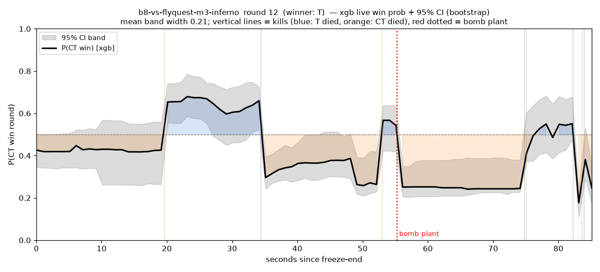

# Where Win Probability Comes From, and Where It Breaks

**Live, per-second round win probability for Counter-Strike 2, with an out-of-time reality check.**

Henry Huang, Haiwen Lu, Jonathan David Pipping, Abraham J. Wyner
Wharton Sports Analytics & Business Initiative, University of Pennsylvania; University of Washington

📄 **Preprint:** [`paper/CS2_Win_Probability_preprint.pdf`](paper/CS2_Win_Probability_preprint.pdf) (working draft v13.1) ·
LaTeX source in [`paper/tex/`](paper/tex) · version history in [`paper/CHANGELOG.md`](paper/CHANGELOG.md)

---

## What this is

A per-second model of P(counter-terrorists win the round) for professional Counter-Strike 2 on the map
*de_inferno*, built from 220 tier-1 matches (476,595 one-second snapshots, 2024–25) and tested once on
27 unseen matches from 2026. The paper uses the model to ask three questions that a single pooled AUC
hides: where the predictive signal actually lives, which spatial representation is predictive, and
whether the model survives a change of season.



## Main findings

- **Pooled AUC flatters.** Every model reaches an AUC near 0.85, but on genuinely even snapshots (equal
  players alive, equipment within $1,500) every model falls to about 0.58. We propose this
  *contested-AUC* as the honest metric, and show model-free that the dominant even state (5-v-5 on equal
  buys) is close to irreducibly random.
- **Physical realism is not predictive power.** Three map-control models were compared: nearest-player
  (Voronoi) territory, an instantaneous line-of-sight / field-of-view / smoke model, and the same model
  with 15-second memory. The most realistic one is the least predictive until it is given memory:
  stability, not fidelity, carries the signal.
- **A three-term defuse race** (fuse time left, minus path time of the nearest counter-terrorist, minus
  defuse time) is the strongest feature beyond economy and cuts post-plant log-loss by 7–8%.
- **Nine architectures tie.** Logistic regression, four tree ensembles, a temporal CNN, a Transformer, a
  player-graph attention network and their ensemble are statistically indistinguishable in
  cross-validation; the two sequence models tie the classical ones out-of-time as well.
- **The best cross-validated model fails out-of-time.** Everything computed from the demo itself transfers
  to 2026 unchanged; a player-skill prior joined from an external database collapses the best in-sample
  model (AUC 0.852 → 0.824). Rebuilt under three data regimes and four encodings, the skill prior never
  beats the skill-free model out-of-time.
- **Economy dominates because it arrives first** (v13). Money alone reaches AUC 0.83 and is the only
  information available when the round starts; the non-economy features together recover about 92% of
  the full model's signal, but only later in the round.
- **The round-start prior** (v13). Before anyone moves, the buy is the whole signal; team and player
  priors add almost nothing. The live curve starts where it should but moves about 30% more than an honest
  sequential forecast anchored at that prior.

Work beyond v13 (a state-space model from round to map win probability, in the spirit of Brill, Yurko
and Wyner, JQAS 2026) is documented in [`docs/studies/`](docs/studies) and is not yet in the paper.

## Repository layout

```
paper/            preprint PDF, LaTeX source + figures (paper/tex), version log, markdown draft
src/
  data/           demo extraction, parsing (awpy), label validation, match-list construction
  features/       the feature pillars: economy, map control, tactical/bomb, defuse race, firepower
  models/         training + evaluation (train_pipeline.py), studies, holdout, deep models (deep/)
  viz/            every paper figure
jobs/             Slurm scripts for the GPU models (PARCC Betty cluster)
configs/          match lists, season map, player/team reference tables, zone map
outputs/          result tables (CSV) and paper figures (outputs/figures/paper)
exports/          documentation of the processed data packages (round-level and full supplement)
docs/             methodology, per-pillar notes, studies, cluster guides, project history (see docs/README.md)
scripts/          workstation setup for cluster access
tests/            unit tests
```

## Data

**In the repository:** the exact match lists (`configs/demo_list_final.csv`, 220 training maps;
`configs/demo_list_2026_test.csv`, 27 held-out maps) with events, dates, teams, scores and HLTV links; the
season map; the HLTV player and team reference tables used by the firepower pillar; and every result table
behind the paper's figures.

**Not in the repository** (size): the GOTV demos (~300 GB), the parsed per-tick channels, and the
modelling tables (476,595 × 135 training, 55,271 × 115 test). Two ways to obtain them:

1. **Rebuild from public demos.** Every match links to its HLTV page, where the GOTV demo is public.
   Download the archives into `demos/raw/`, then run the pipeline below. Assembly needs awpy's
   `de_inferno` navigation mesh (`~/.awpy/navs/de_inferno.json`).
2. **Processed bundle.** The parsed channels and modelling tables are packaged as described in
   [`exports/cs2_inferno_raw_supplement_v1/README.md`](exports/cs2_inferno_raw_supplement_v1/README.md);
   contact the authors for access.

The 2026 matches are a **touch-once** out-of-time test set: every out-of-time number in the paper comes
from a single scoring after the design was frozen. If you use the data, please keep it that way.

## Setup

Python 3.11 or newer.

```bash
python -m venv .venv
source .venv/bin/activate            # Windows: .venv\Scripts\activate
pip install -r requirements.txt      # torch / torch-geometric only needed for the deep models
python tests/test_defuse_progress.py # quick self-check, no data needed
```

## Reproducing the results

With the modelling tables in `data/` (`training_dataset.parquet`, `test_dataset_2026*.parquet`):

| Result | Command |
|---|---|
| Model × feature-set matrix, DeLong, bootstrap CIs | `python src/models/train_pipeline.py --models logreg,xgb --sets A,E,EB2,EFB2 --bootstrap 500` |
| Full metric battery for a model | `python src/models/model_report.py --models logreg,xgb --sets E,EB2` |
| Out-of-time 2026 holdout | `python src/models/holdout_2026.py` |
| Residual (beyond-economy) analysis | `python src/models/residual_analysis.py` |
| Contested-round ceiling | `python src/models/contested_study.py` |
| Trajectory (extreme-path) calibration | `python src/models/pathwise_calibration.py` |
| No-economy ablation (v13) | `python src/models/noecon_ablation.py` |
| Round-start prior (v13) | `python src/models/pilot_t0_round_start.py` |
| Round-to-map state model (in progress) | `python src/models/map_wp.py` |
| Paper figures | `python src/viz/paper_figures.py` and the other scripts in `src/viz/` |
| Deep models (GPU) | `sbatch jobs/tcn_cv.sh`, `jobs/transformer_cv.sh`, `jobs/gat_cv.sh` (see [`docs/cluster/`](docs/cluster)) |

From raw demos: `src/data/extract_demos.py` → `src/data/batch_parse.py` → `src/data/validate_parquet.py`
→ `src/features/assemble.py`. The round-start and round-to-map studies read the parsed channels in the
layout of the processed bundle (`data/cs2_inferno_raw_supplement_v1/`).

**Evaluation protocol**, used everywhere: 5-fold cross-validation grouped by match (a match is never split
across folds), match-level block bootstrap for every interval, paired bootstrap for every comparison, and a
single disclosed scoring of the 2026 holdout. The full checklist is in
[`docs/methodology/FULL_BENCHMARK.md`](docs/methodology/FULL_BENCHMARK.md).

## Citation

```bibtex
@misc{huang2026winprobability,
  title  = {Where Win Probability Comes From, and Where It Breaks: Spatial Control, Bomb Geometry,
            and an Out-of-Time Reality Check for Live Win Probability in Counter-Strike 2},
  author = {Huang, Henry and Lu, Haiwen and Pipping, Jonathan David and Wyner, Abraham J.},
  year   = {2026},
  note   = {Working paper, version 13.1},
  url    = {https://github.com/Henry1145141919810/CS2_Win_Probability_Model}
}
```

GitHub's "Cite this repository" button reads [`CITATION.cff`](CITATION.cff).

## License

No license has been chosen yet. Until one is added, the authors retain all rights; please open an issue if
you would like to reuse the code or data.

## Acknowledgements

Demos from HLTV.org; parsing with [awpy](https://github.com/pnxenopoulos/awpy); match lists cross-checked
against Liquipedia. Deep-learning experiments ran on the Betty cluster of the Penn Advanced Research
Computing Center (PARCC), University of Pennsylvania.
