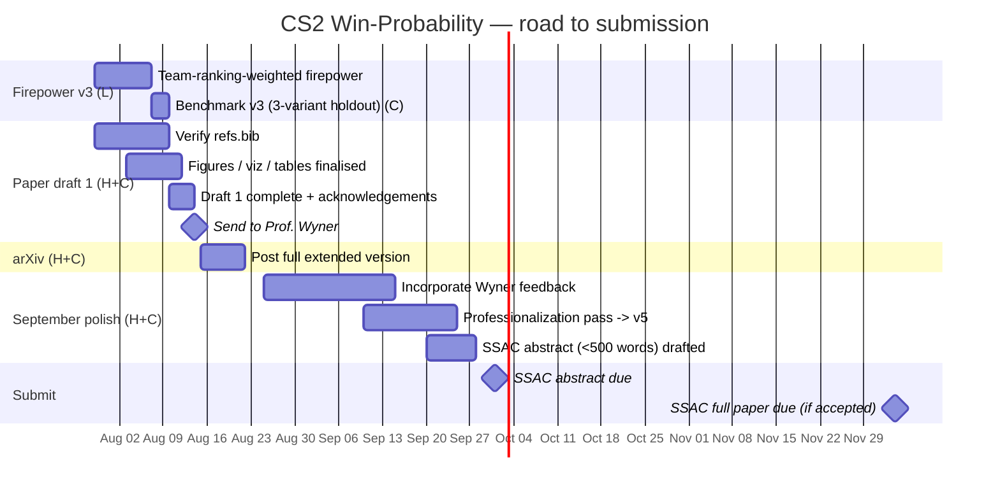

# Project Roadmap & Tracker (Henry + Leu)

Shared progress tracker. Both of us update it: tick the checkboxes, change a status, commit, push.
Companion docs: [submission_requirements.md](submission_requirements.md) (all venue rules + links),
[notes_lagged_holdout.md](notes_lagged_holdout.md) (firepower results), [paper/CHANGELOG.md](paper/CHANGELOG.md).

**Owners:** H = Henry, L = Leu, C = Claude (assists).
**Status keys:** ☐ todo · ◐ in progress · ☑ done.

---

## Important date correction (read first)

The Oct 1 target is **not** the full-paper deadline. MIT Sloan (our primary venue) runs in two stages:

| Stage | Deadline | What is due |
|---|---|---|
| **Abstract** | **Oct 1, 2026, 11:59pm EST** | < 500 words (Intro / Methods / Results / Conclusion) + up to 2 figures/tables, plus the open-source repo link |
| Decision | late Oct 2026 | full-paper invitations sent |
| **Full paper** | **Dec 4, 2026, 11:59pm** | ~6-page paper (+ up to 3-page appendix), only if the abstract is accepted |

So Oct 1 needs a strong abstract, not the finished paper. The full paper has until Dec 4. Details and
links in [submission_requirements.md](submission_requirements.md).

---

## Timeline

---

## Milestone 1 — Firepower v3 (target Aug 7) · owner L — ☑ DONE (negative result)

**Goal:** replace the count-confounded summed HLTV rating with a **team-world-ranking-weighted**
firepower feature. Rationale: a top-1 team and a top-30 team can show similar HLTV firepower listings,
but the top-1 team should carry more weight. Team ranking is a more stable, less count-confounded
signal than individual season rating, so it directly tests whether a *better encoding* transfers where
the summed rating did not (the summed rating fails under every construction; see
[notes_lagged_holdout.md](notes_lagged_holdout.md)).

- [x] (L) Source world team rankings per era (HLTV team ranking, dated snapshots for 2024 / 2025 / 2026)
- [x] (L) Define the weighting scheme (e.g. weight by inverse rank or rank-tier) and document it
- [x] (L) Add v3 columns to the firepower pillar; keep v1/v2 intact for comparison
- [x] (L) Validate coverage and ranges; commit `configs/` + code, push
- [x] (C) Benchmark v3: in-time OOF proxy test, three weighting schemes (1/log₂, 1/rank, linear)
- [x] (C) Decide verdict: does team-ranking weighting beat EB2 out-of-time? Record in notes

**Verdict (2026-08-02):** Negative. All three v3 weighting schemes score below EFB2 (raw sum)
in-sample. EFB2 itself is already dominated by EB2 out-of-time. The failure is structural: HLTV
rating already embeds opponent-quality implicitly; re-weighting by team rank double-penalises
lower-ranked players and removes signal. No further firepower variants planned.
See [notes_firepower_v3.md](notes_firepower_v3.md) for full analysis.

## Milestone 2 — Paper draft 1 complete (target Aug 14) · owner H + C

**Goal:** a complete draft 1 with everything in place, sent to Prof. Wyner for review.

- [ ] (C) Verify every `refs.bib` entry against DOI / DBLP (remove all `% VERIFY` markers) — **#1 blocker**
- [ ] (H) Provide Leu's affiliation + email; confirm author order
- [ ] (H/C) PARCC allocation acknowledgement (required by their terms of use)
- [ ] (C) Fold firepower v3 result into the firepower section (if v3 lands in time)
- [ ] (C) Finalise all figures, tables, captions; Appendix B full metric battery
- [ ] (C) Fill remaining `\todo{}`s in `main.tex`
- [ ] (H) Read through for correctness of claims and numbers
- [ ] **(H) Send draft 1 to Prof. Wyner requesting review** ← milestone

## Milestone 3 — September polish → submission-ready (Oct 1 abstract) · owner H + C

- [ ] (H/C) Incorporate Wyner's feedback
- [ ] (C) **Professionalization pass → paper v5**: rewrite to formal submission register (result-first,
      concise, no colloquialisms, no em-dash asides). Do once science is frozen.
- [ ] (C) Draft the SSAC abstract: < 500 words, sections Intro / Methods / Results / Conclusion, ≤ 2 figures
- [ ] (H) Confirm the public GitHub repo is clean and presentable (it is the required open-source link)
- [ ] (H) Register / prepare the SSAC submission account
- [ ] **(H) Submit SSAC abstract by Oct 1, 2026, 11:59pm EST** ← milestone

## Milestone 4 — arXiv preprint (target mid-Aug, after draft 1) · owner H + C

- [ ] (H) Ensure Henry is a registered arXiv author; obtain a cs.LG endorsement if needed (a upenn.edu
      affiliation usually suffices) — start early, endorsement can take days
- [ ] (C) Prepare the full extended version (no page limit) for arXiv
- [ ] (H) Submit to arXiv (cs.LG primary; cross-list stat.AP). See Q&A below on full vs conference version.

## Milestone 5 — SSAC full paper (Dec 4, only if abstract accepted) · owner H + C

- [ ] (C) Compress the full version to SSAC format (~6 pages + ≤3-page appendix)
- [ ] (H) Submit full manuscript by Dec 4, 2026

---

## arXiv vs conference version — the plan

Post **both**, as two different artifacts:

- **arXiv = the full extended version.** No page limit, so it carries the complete work (all pillars,
  all three firepower variants, deep-model out-of-time, appendices). This is the canonical record and
  is citeable.
- **SSAC = a formatted subset.** The 500-word abstract (Oct 1), then the ~6-page paper (Dec 4). The
  paper cites the arXiv version as "extended version available at arXiv:XXXX."

This is standard and allowed: SSAC requires a public repo and is not double-blind, so an arXiv preprint
does not conflict with it. Post the arXiv version once the content is frozen (Milestone 4), before or
after the abstract; posting before Oct 1 stakes the contribution and lets the abstract cite it.

---

## Research extensions — beyond-economy signal (adds to the paper)

Two studies planned in detail in [plan_beyond_economy.md](plan_beyond_economy.md). Both strengthen the
Dec 4 full paper / arXiv extended version; neither blocks the Oct 1 abstract.

- **Study 1 — Residual analysis (C).** Fit economy alone, then measure the signal the spatial/tactical
  pillars add *orthogonally* (stacked-logit / FWL partialling-out). Small, high-rigor, reuses the
  pipeline. Do first.
  - [ ] `src/models/residual_analysis.py`; paired-bootstrap ΔAUC/Δlog-loss in-time + out-of-time
  - [ ] beyond-economy feature-importance ranking; Results subsection
- **Study 2 — Contested-round ceiling (C).** Model even rounds directly; decompose the 0.58 gap into
  aleatoric vs recoverable via an information-saturation curve + a matching-based Bayes-error estimate.
  **Must run at snapshot/duel level, not round level (round-level contested is underpowered, ±0.05 CI).**
  - [ ] `src/models/contested_study.py`; graded-evenness curve; specialist vs generalist
  - [ ] saturation curve + Bayes-error estimator; Results + Discussion
  - [ ] (sub-study) duel dataset from the kills channel; duel-win-probability model (power-correct home)
